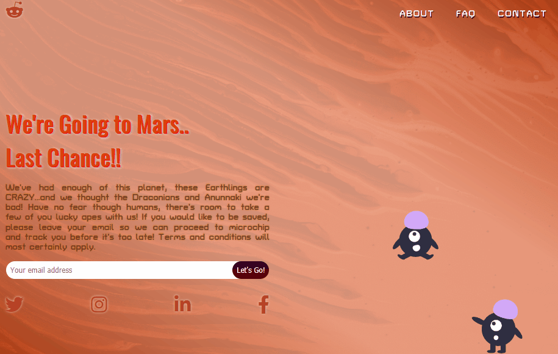

<!--------------------->
<!-- PROJECT SHIELDS -->
<!--------------------->

[![Contributors][contributors-shield]][contributors-url]
[![Forks][forks-shield]][forks-url]
[![Stargazers][stars-shield]][stars-url]

<!------------------>
<!-- PROJECT LOGO -->
<!------------------>
 

  <h1>Animated SVG using CSS</h1>
  <h3>README</h3>
  
    
    <a href="https://github.com/BrettFlavin/ResponsiveWeb-AnimatedSVG/issues">Report Bug</a>
    ·
    <a href="https://github.com/BrettFlavin/ResponsiveWeb-AnimatedSVG/issues">Request Feature</a>
  

<!----------------------->
<!-- TABLE OF CONTENTS -->
<!----------------------->

## Table of Contents

- [About the Project](#about-the-project)
- [Built With](#built-with)
- [Usage](#usage)
- [Contact](#contact)
- [Acknowledgements](#acknowledgements)

<!----------------------->
<!-- ABOUT THE PROJECT -->
<!----------------------->

## About The Project

This just started off as a joke, but the intent was to learn more about responsive web design, CSS, and animations in particular. 

To do this, I first located an open-source illustration and downloaded it as an SVG. Next, I took this SVG image and opened it up in Figma. Here, changes can be made to the shapes, paths, colors, etc. that make up the image. I made the changes I wanted, grouped and named each section that will be animated with CSS, and then exported the file from Figma as an SVG. In Figma, you must ensure to click the checkbox 'include id attribute' before exporting the SVG. Now, each section of the image has an id tag that can be accessed with CSS and animated. 

The SVG can be simply be transferred into the project folder and once it's opened in VS code you can see all the SVG information for each path including the ids from Figma. Simply copy/paste this info and then it can be embedded directly into the HTML file with the inline svg tag.

<!---------------->
<!-- BUILT WITH -->
<!---------------->

### Built With

This application was created in VS Code using HTML and CSS. The alien image was found online and edited using Figma. A CDN was used to import the font awesome reddit alien icon. This project is in the style of a landing-page or single page web site and been made responsive for different size devices.

Some of the techniques I used here include CSS flexbox and grid, CSS animations, and animation delays to animate individual paths of an SVG image. CSS Media queries were then used to make the page responsive between a laptop and a smaller mobile device.

<!-------------------->
<!-- USAGE EXAMPLES -->
<!-------------------->

## Usage

the animated SVG image:

 
 

responsive web design for laptop and mobile devices:

 
 

<!------------->
<!-- CONTACT -->
<!------------->

## Contact

Author:
 
Brett R. Flavin - brettflavin@yahoo.com

Project Link: [https://github.com/BrettFlavin/ResponsiveWeb-AnimatedSVG](https://github.com/BrettFlavin/ResponsiveWeb-AnimatedSVG)

<!---------------------->
<!-- ACKNOWLEDGEMENTS -->
<!---------------------->

## Acknowledgements

- [othneildrew - readme template](https://github.com/othneildrew/Best-README-Template)
- [unDraw](https://undraw.co/illustrations)
- [Figma](https://figma.com)
- [Font-Awesome](https://fontawesome.com)

  <!-------------------->
  <!-- MARKDOWN LINKS -->
  <!-------------------->

[contributors-shield]: https://img.shields.io/github/contributors/BrettFlavin/ResponsiveWeb-AnimatedSVG?style=plastic
[contributors-url]: https://github.com/BrettFlavin/ResponsiveWeb-AnimatedSVG/graphs/contributors
[forks-shield]: https://img.shields.io/github/forks/BrettFlavin/ResponsiveWeb-AnimatedSVG?style=plastic
[forks-url]: https://github.com/BrettFlavin/ResponsiveWeb-AnimatedSVG/network/members
[stars-shield]: https://img.shields.io/github/stars/BrettFlavin/ResponsiveWeb-AnimatedSVG?style=plastic
[stars-url]: https://github.com/BrettFlavin/ResponsiveWeb-AnimatedSVG/stargazers
